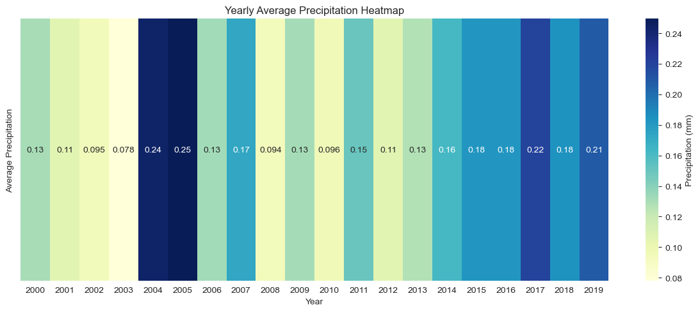

# Weather Temperature Prediction System

## Overview
A comprehensive weather temperature prediction system using ensemble machine learning methods (Random Forest and XGBoost) to forecast daily temperatures (minimum, maximum, and average) with confidence intervals. The system includes extensive data visualization, analysis tools, and prediction capabilities.

## Table of Contents
- [Features](#features)
- [Requirements](#requirements)
- [Installation](#installation)
- [Usage](#usage)
- [Data Format](#data-format)
- [Model Architecture](#model-architecture)
- [Results](#results)
- [Visualization Examples](#visualization-examples)
- [Contributing](#contributing)
- [License](#license)
- [ScreenShot](#screenshot)

## Features
- Temperature prediction (TMIN, TMAX, TAVG)
- Confidence interval estimation
- Extensive data visualization tools
- Historical data analysis
- Precipitation pattern analysis
- Multiple prediction timeframes
- Ensemble model approach
- Feature engineering pipeline
- Performance metrics evaluation

## Requirements
```
python>=3.8
pandas
numpy
matplotlib
seaborn
scikit-learn
xgboost
nbformat
```

## Installation
1. Clone the repository:
```bash
git clone https://github.com/RRafi89/Weather-Temperature-Prediction.git
cd Weather-Temperature-Prediction
```

2. Install required packages:
```bash
pip install -r requirements.txt
```

## Usage
### Basic Usage
```python
# Load and prepare data
train_df = pd.read_csv('train.csv', index_col='DATE', parse_dates=True)
validation_df = pd.read_csv('test.csv', index_col='DATE', parse_dates=True)

# Train models
train(train_df)

# Make predictions
results = predict_future(
    df=train_df,
    n_days=365,
    actual_data=validation_df,
    plot=True
)

# Get specific date predictions
target_dates = ['2020-06-15']
get_temperature_for_dates(results, target_dates)
```

### Advanced Usage
```python
# Custom date range predictions
predict_future_specific_dates(
    df=train_df,
    target_dates=['2020-05-09', '2020-06-22'],
    models=models,
    features=features
)
```

## Data Format
Required CSV format:
```
"STATION","NAME","LATITUDE","LONGITUDE","ELEVATION","DATE","PRCP","TAVG","TMAX","TMIN"
"BGM00041907","ISHURDI, BG","24.153","89.049","13.7","2000-01-01","0.00","61","75",
```

Required columns:
- DATE: DateTime format
- TAVG: Average temperature
- TMAX: Maximum temperature
- TMIN: Minimum temperature
- PRCP: Precipitation

## Model Architecture
### Feature Engineering
- Temporal features (year, month, day, season)
- Rolling statistics
- Lag features
- Cyclical encoding
- Temperature derivatives
- Hyperparameter searched using Optuna

### Models
1. Random Forest Regressor
   - n_estimators: 307
   - max_depth: 30
   - Custom hyperparameters

2. XGBoost Regressor
   - n_estimators: 466
   - max_depth: 14
   - Learning rate: 0.0408
   - Custom hyperparameters

### Ensemble Approach
- Weighted combination (RF: 0.2, XGB: 0.8)
- Confidence interval estimation using RF estimators

## Results
### Model Performance Metrics
- RMSE (Root Mean Square Error)
- MAE (Mean Absolute Error)
- MAPE (Mean Absolute Percentage Error)
- RMSLE (Root Mean Square Logarithmic Error)

### Key Findings
- Strong predictive accuracy for all temperature metrics
- Reliable confidence interval estimation
- Effective capture of seasonal patterns
- Robust performance in various weather conditions

## Visualization Examples
The system provides various visualization capabilities:
- Temperature trend analysis
- Precipitation patterns
- Seasonal decomposition
- Prediction confidence intervals
- Correlation analysis
- Monthly and yearly patterns

## Contributing
1. Fork the repository
2. Create your feature branch (`git checkout -b feature/AmazingFeature`)
3. Commit your changes (`git commit -m 'Add some AmazingFeature'`)
4. Push to the branch (`git push origin feature/AmazingFeature`)
5. Open a Pull Request

## License
This project is licensed under the MIT License - see the [LICENSE.md](LICENSE.md) file for details

## Acknowledgments
- Data source: NOAA DAILY TEMPERATURE DATA

## Contact
Phone: +8801846385072
Md. Rafiquzzaman - [Email](mailto:rafiquzzamanrafi100@gmail.com)  
Project Link: [Weather Temperature Prediction](https://github.com/RRafi89/Weather-Temperature-Prediction.git)


## Citation
If you use this project in your research or work, please cite:
```
@software{weather_prediction_2025,
  author = {Rafiquzzaman Rafi},
  title = {Weather Temperature Prediction System},
  year = {2025},
  publisher = {GitHub},
  url = {https://github.com/RRafi89/Weather-Temperature-Prediction.git}
}
```
## Screenshot



